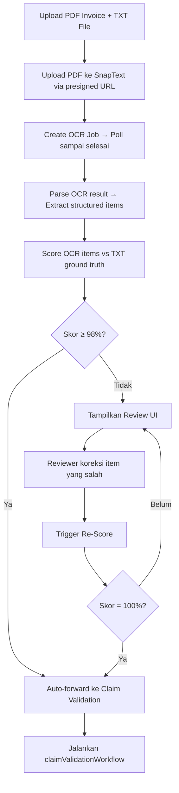

# Integrasi SnapText OCR → Invoice Scoring → Claim Validation

## Konteks

Saat ini claim data di CONSUL diinput secara manual melalui PathwayWizard atau diimport dari JSON. Fitur baru ini memungkinkan user untuk **upload PDF invoice** yang akan di-OCR via SnapText, lalu di-**scoring** terhadap TXT ground truth file. Jika skor < 98%, reviewer dapat mengoreksi item-item yang salah. Skor 100% → langsung forward ke claim validation workflow.

## User Flow



## Proposed Changes

### Database Schema

#### [MODIFY] [schema.prisma](file:///d:/Ex-Project/snap-path/prisma/schema.prisma)

Tambah model baru `OcrJob` untuk tracking OCR jobs:

```prisma
model OcrJob {
  id              String    @id @default(uuid())
  clientId        String?
  client          Client?   @relation(fields: [clientId], references: [id])
  providerId      String?
  provider        Provider? @relation(fields: [providerId], references: [id])
  
  // File references
  pdfStoragePath  String    // Supabase storage path for uploaded PDF
  pdfUrl          String    // SnapText-accessible URL for the PDF
  txtStoragePath  String?   // Supabase storage path for TXT ground truth
  txtContent      String?   // Parsed TXT content (stored for scoring)
  
  // SnapText job tracking
  snaptextJobId   String?   // Job ID from SnapText API
  snaptextStatus  String    @default("PENDING") // "PENDING" | "UPLOADING" | "PROCESSING" | "COMPLETED" | "FAILED"
  
  // OCR results & scoring
  ocrRawResult    Json?     // Raw OCR output from SnapText
  ocrItems        Json?     // Parsed structured items from OCR: { items: [{ field, ocrValue, correctedValue? }] }
  txtItems        Json?     // Parsed structured items from TXT ground truth
  matchScore      Float?    // 0-100 matching score
  scoringDetails  Json?     // Per-item scoring breakdown: [{ field, expected, actual, match: boolean }]
  
  // Lifecycle
  status          String    @default("PENDING") // "PENDING" | "OCR_PROCESSING" | "SCORING" | "REVIEW_NEEDED" | "APPROVED" | "FORWARDED" | "FAILED"
  claimJobId      String?   // Linked ClaimJob ID once forwarded
  errorMessage    String?
  reviewedByUserId String?
  
  createdAt       DateTime  @default(now())
  updatedAt       DateTime  @updatedAt

  @@index([clientId])
  @@index([status])
  @@index([claimJobId])
  @@map("snp_ocr_job")
}
```

> [!IMPORTANT]
> Tambahkan relasi `ocrJobs OcrJob[]` ke model `Client` dan `Provider`.

---

### SnapText Client Library

#### [NEW] [snaptext.ts](file:///d:/Ex-Project/snap-path/src/lib/snaptext.ts)

Wrapper untuk SnapText API. Env var: `SNAPTEXT_API_KEY`.

```typescript
// Core functions:

/** Step 1: Get presigned upload URL */
export async function getSnaptextUploadUrl(filename: string, fileSize: number): Promise<{
  uploadUrl: string;
  pdfUrl: string;
}>

/** Step 2: Upload PDF to presigned URL */
export async function uploadPdfToSnaptext(uploadUrl: string, pdfBuffer: Buffer): Promise<void>

/** Step 3: Create OCR job */
export async function createSnaptextJob(pdfUrl: string): Promise<{
  jobId: string;
  status: string;
}>

/** Step 4: Poll job status (with exponential backoff) */
export async function pollSnaptextJob(jobId: string): Promise<{
  status: string;
  result?: unknown;
}>
```

---

### OCR Scoring Engine

#### [NEW] [ocr-scoring.ts](file:///d:/Ex-Project/snap-path/src/lib/ocr-scoring.ts)

Logic untuk membandingkan OCR output vs TXT ground truth.

```typescript
export interface OcrItem {
  field: string;        // e.g. "patient_name", "procedure_1_name", "procedure_1_price"
  value: string;        // OCR extracted value
  correctedValue?: string; // Reviewer correction (if any)
}

export interface TxtItem {
  field: string;
  value: string;        // Expected value from TXT ground truth
}

export interface ScoringDetail {
  field: string;
  expected: string;     // From TXT
  actual: string;       // From OCR (or corrected)
  match: boolean;
  similarity: number;   // 0-1 fuzzy match score
}

export interface ScoringResult {
  score: number;        // 0-100
  totalFields: number;
  matchedFields: number;
  details: ScoringDetail[];
}

/** Parse TXT file into structured items (key=value format) */
export function parseTxtGroundTruth(txtContent: string): TxtItem[]

/** Parse SnapText OCR result into structured items */
export function parseOcrResult(ocrRawResult: unknown): OcrItem[]

/** Score OCR items against TXT ground truth */
export function scoreOcrAgainstTxt(ocrItems: OcrItem[], txtItems: TxtItem[]): ScoringResult

/** Apply reviewer corrections and re-score */
export function applyCorrectionsAndRescore(
  ocrItems: OcrItem[], 
  corrections: Record<string, string>, 
  txtItems: TxtItem[]
): { updatedItems: OcrItem[]; scoring: ScoringResult }
```

> [!IMPORTANT]
> **Perlu klarifikasi format TXT**: Apakah TXT file menggunakan format `key=value` per baris, atau format lain (CSV, tab-delimited, JSON lines)? Ini menentukan implementasi `parseTxtGroundTruth()`. Sementara ini saya asumsikan format `key=value` per baris, contoh:
> ```
> patient_name=John Doe
> procedure_1_name=Appendectomy
> procedure_1_price=5000000
> medication_1_name=Paracetamol
> ```

---

### API Routes

#### [NEW] [route.ts](file:///d:/Ex-Project/snap-path/src/app/api/v1/ocr/upload/route.ts)

`POST /api/v1/ocr/upload` — Upload PDF + TXT, trigger OCR pipeline.

- Accept: `multipart/form-data` with fields `pdfFile`, `txtFile`, `providerId`
- Upload PDF ke Supabase Storage → get signed URL
- Upload ke SnapText presigned URL
- Create SnapText job
- Create `OcrJob` record in DB
- Return `ocrJobId`

#### [NEW] [route.ts](file:///d:/Ex-Project/snap-path/src/app/api/v1/ocr/poll/route.ts)

`GET /api/v1/ocr/poll?ocrJobId=xxx` — Poll OCR job status.

- Check SnapText job status
- If completed: parse result, score against TXT, update DB
- Return: `{ status, matchScore, scoringDetails, ocrItems }`

#### [NEW] [route.ts](file:///d:/Ex-Project/snap-path/src/app/api/v1/ocr/correct/route.ts)

`POST /api/v1/ocr/correct` — Submit corrections and re-score.

- Accept: `{ ocrJobId, corrections: Record<string, string> }`
- Apply corrections to ocrItems
- Re-score against TXT
- If score = 100%: auto-forward to claim validation
- Return: `{ matchScore, scoringDetails, forwarded: boolean, claimJobId? }`

#### [NEW] [route.ts](file:///d:/Ex-Project/snap-path/src/app/api/v1/ocr/forward/route.ts)

`POST /api/v1/ocr/forward` — Manually forward to claim validation (score ≥ 98%).

- Construct claim payload from corrected OCR items
- Call same logic as `/api/v1/claims/validate`
- Link `OcrJob.claimJobId`

---

### Dashboard UI

#### [NEW] [page.tsx](file:///d:/Ex-Project/snap-path/src/app/dashboard/clinical-pathway/ocr-import/page.tsx)

Halaman baru untuk OCR Import flow. Server component.

#### [NEW] [OcrUploadWizard.tsx](file:///d:/Ex-Project/snap-path/src/app/dashboard/clinical-pathway/components/OcrUploadWizard.tsx)

Client component — wizard for uploading PDF + TXT and monitoring OCR progress.

**States:**
1. **Upload** — Drag & drop / file picker untuk PDF invoice + TXT ground truth
2. **Processing** — Polling OCR status (spinner + step indicator)
3. **Scoring Result** — Show score + item-by-item comparison table
4. **Review** (if score < 98%) — Editable table showing mismatched items
5. **Forwarded** — Redirect ke claim validation result page

#### [NEW] [OcrReviewTable.tsx](file:///d:/Ex-Project/snap-path/src/app/dashboard/clinical-pathway/components/OcrReviewTable.tsx)

Client component — tabel review per item mana yang tidak match.

| # | Field | Expected (TXT) | OCR Result | Match | Action |
|---|-------|-----------------|------------|-------|--------|
| 1 | patient_name | John Doe | Jchn Doe | ❌ | `[input editable]` |
| 2 | procedure_1_price | 5000000 | 5000000 | ✅ | — |
| 3 | medication_1_name | Paracetamol | Paracetam0l | ❌ | `[input editable]` |

- Hanya item yang tidak match yang editable
- Tombol **"Cek Ulang Skor"** → call `/api/v1/ocr/correct`
- Jika skor = 100%, tampilkan tombol **"Lanjut ke Validasi Klaim"** → call `/api/v1/ocr/forward`

---

### Navigation

#### [MODIFY] [DashboardShell.tsx](file:///d:/Ex-Project/snap-path/src/components/dashboard/DashboardShell.tsx)

Tambah menu item "OCR Import" di sidebar di bawah "Clinical Pathway".

---

### Environment Variables

#### [MODIFY] [.env](file:///d:/Ex-Project/snap-path/.env)

```
SNAPTEXT_API_KEY=your_snaptext_api_key_here
```

---

## Open Questions

> [!IMPORTANT]
> **Format TXT Ground Truth**: Bagaimana format TXT file yang akan diupload? 
> - `key=value` per baris?
> - CSV / tab-delimited?
> - Structured JSON?
> - Free-text yang perlu di-parse?
> 
> Ini krusial untuk implementasi parser dan scoring engine.

> [!IMPORTANT]
> **SnapText OCR Output Structure**: Apakah SnapText mengembalikan structured data (JSON with fields) atau plain text? Jika plain text, kita perlu implementasi parsing layer tambahan (possibly AI-assisted) untuk extract structured fields dari OCR text.

> [!IMPORTANT]
> **Threshold Scoring**: Anda menyebutkan 98% untuk auto-forward. Apakah ini final? Dan apakah reviewer boleh manually forward jika skor di antara 98-99% (sudah cukup baik tapi belum 100%)?

> [!IMPORTANT]
> **Mapping OCR → Claim Payload**: Bagaimana mapping dari field-field OCR result ke format payload `claim validation`? Apakah TXT file juga berfungsi sebagai mapping template, atau kita butuh mapping config terpisah?

## Verification Plan

### Automated Tests
```powershell
npx tsc --noEmit
npx prisma validate
```

### Manual Verification
1. Upload PDF invoice + TXT file → pastikan OCR job created
2. Poll sampai selesai → pastikan scoring benar
3. Jika skor < 98% → pastikan review UI muncul
4. Koreksi item → re-score → pastikan skor ter-update
5. Forward ke claim validation → pastikan ClaimJob created dan workflow berjalan
6. Test direct 100% match → pastikan auto-forward
